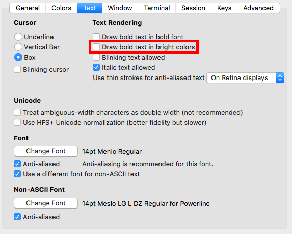

# Provisioning a New Machine

New machines require two tasks to be done which are not part of the setup
script: installing (and using) Powerline-compatible fonts and using the
Solarized colorscheme. This configuration uses a zsh theme similar to Agnoster.
It also uses Powerline for vim and tmux. As a result, you'll need to install
patched fonts that support Powerline.

## MacOS

### Installing Powerline-compatible Fonts

There is a `fonts` directory that contains several fonts that work with
Powerline. You can install them by running the installation script in that
subdirectory.

```bash
cd ~/.dotfiles/new_machine/fonts
./install.sh
```

Next you will want to change the fonts in your iTerm profile. Go to the `Text`
tab in your current profile and pick an appropriate font.

### Solarized on iTerm

Import `Solarized Dark.itermcolors` as a colorscheme for iTerm. In the `Colors`
section of your profile, use the `Solarized Dark` preset. To get the directory
colors to work, you'll need to uncheck the `Draw bold text in bright colors`
setting.

  

## Linux

### Patching the Font to be Powerline-compatible

Follow these commands to patch the font.

```bash
cd ~/.dotfiles/new_machine
mkdir -p ~/.fonts/
cp PowerlineSymbols.otf ~/.fonts/
mkdir -p ~/.config/fontconfig/conf.d
fc-cache -vf ~/.fonts/
cp 10-powerline-symbols.conf ~/.config/fontconfig/conf.d
```

### Solarized on Ubuntu Terminal

Create a new profile on the terminal emulator.

  

Set that profile to be the default profile upon terminal open.

  

Run the setup script for solarized.

```bash
cd ~/.dotfiles/new_machine/gnome-terminal-colors-solarized
./set_dark.sh
```

## Enable Copy/Paste in Tmux on OSX
On Macs, `pbcopy` and `pbpaste` don't natively work in tmux. Luckly there's a
[Homebrew](http://brew.sh/) formula to fix that.

```bash
brew install reattach-to-user-namespace
```

The tmux configuration will do the rest for you. Note that this only applies to
machines running OSX.

## Enable Mouse Wheel Scrolling in Vim on OSX
If using iTerm, setting `Scroll wheel sends arrow keys when in alternate screen
mode.` to `Yes` will allow trackpad scrolling while in Vim. The setting can be
found in the advanced preferences.
